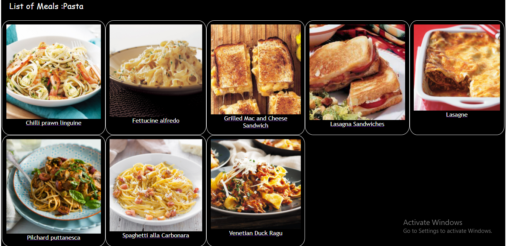
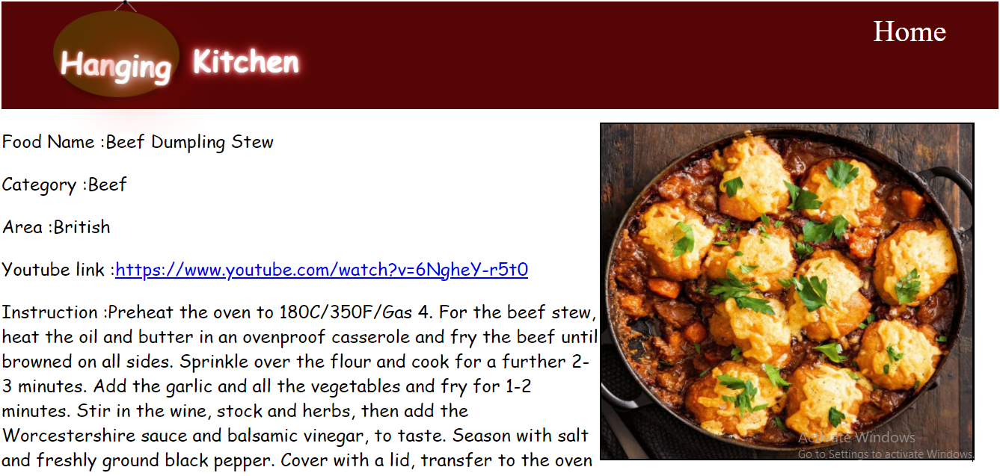

# Hanging Kitchen
It is website about Hanging Kitchen which provide the catalogs of recipes . Here I fetch data from API Link.
Here I've used different animation in css to improve my website UI framework.


 
 
 

## Built With
- Javascript
- React
- Redux
- CSS Bootstrap

## Live Demo

Click on the link below for accessing the deployed website.
### [Hanging Kitchen](https://compassionate-bhabha-2e7fe3.netlify.app/)</p>


## Getting Started

To get a local copy up and running follow these simple example steps.

### Prerequisites
- A browser
- Node js (optional)

### Setup

All code below are for a terminal.

1. Clone repository: 
```sh
  $ git clone https://github.com/Deepakdanger/Hanging_kitchen.git
```
2. Change directory inside project
```sh
cd Hanging_kitchen
```
3. In your terminal, run 
```sh
npm install
```
4. After changes, run webpack to build production code.
```sh
npm run build
```   
5. You can also run the following to access the website on `http://localhost:3000` in your local computer.
```sh
npm run start
```
* Press `Ctrl + c` to exit the `npm run start` session in your terminal.

### Test

For test run `npm run test`.

## Author


👤 **DEEPAK KUMAR**
- GitHub: [@githubhandle](https://github.com/Deepakdanger)

## 🤝 Contributing

Contributions, issues, and feature requests are welcome!

Feel free to check the [issues page](https://github.com/Deepakdanger/calculator/issues).

## Show your support

Give a ⭐️ if you like this project!

## Acknowledgments

- Hat tip to anyone whose code was used
- Inspiration
- etc

## 📝 License

This project is [MIT](/LICENSE) licensed.